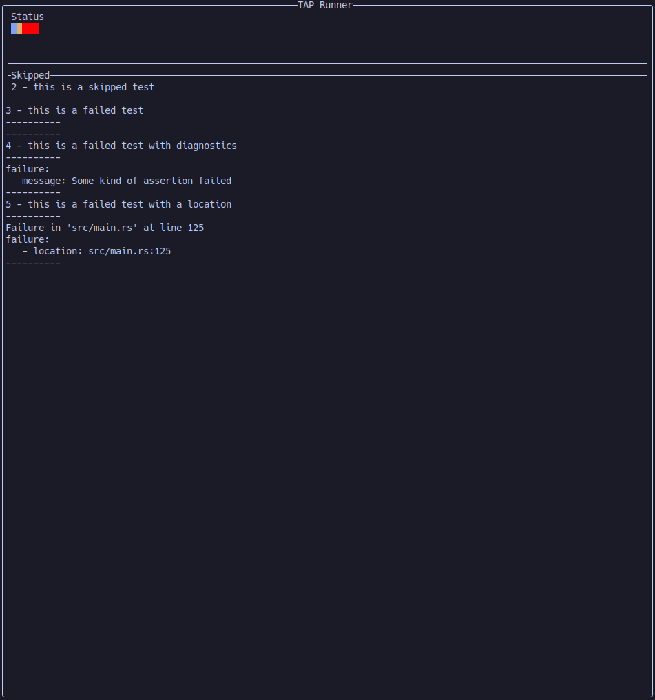
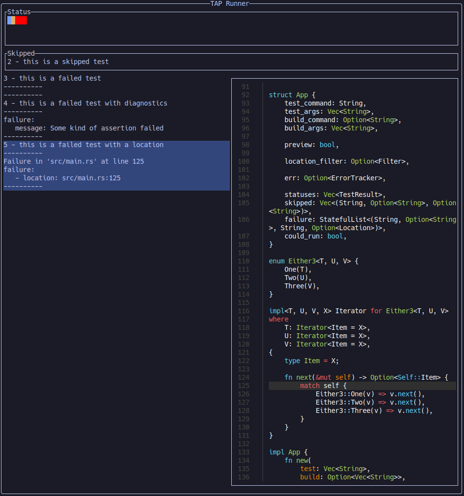
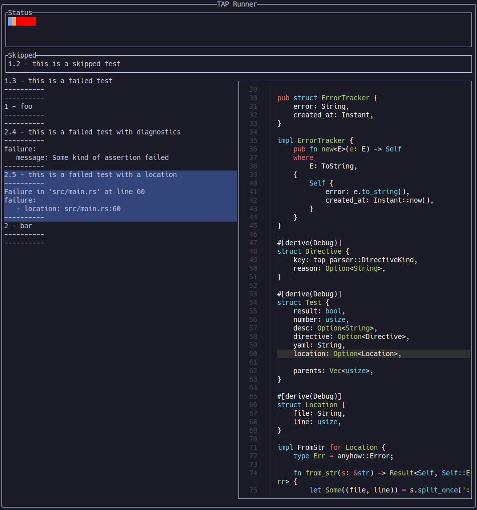

# TAP Runner UI

|      Normal view       |      With preview       |      With subtests       |
| :--------------------: | :---------------------: | :----------------------: |
|  |  |  |

This is a software to preview [TAP](https://testanything.org/) results to be able to quickly iterate on your tests/software.

To use this you need to have Tests that are launchable by a simple command and that output valid TAP on stdout.
You can then simply run `tapr <your test command>...`.
In order to reload the window you can press the `r` key, it will relaunch the command and display the results.

You can pass a build command separated by `,` with the `-b|--build-command` option that will be launched before running the tests.
You may pass the `-l|--location-filter` to extract location information from YAML diagnostics. This takes a `jq` like filter (to be exact it is a [jaq](https://github.com/01mf02/jaq) filter).
Location information must be of the form `<file>:<line>`.

If location information is available, and [`bat`](https://github.com/sharkdp/bat) is installed you may pass the `-p|--preview` to display a preview of the file containing the failure.

## Keybinds

- `r`: Relaunch the tests
- `q`: Quit
- `<up>`: Select the previous failing test
- `<down>`: Select the next failing test
- `<esc>`: Unselect failing tests

## Examples

The example images were obtained with the following TAP files:

`test.tap`:

```
TAP version 14
1..5
ok 1 - this is an ok test
ok 2 - this is a skipped test # SKIP
not ok 3 - this is a failed test
not ok 4 - this is a failed test with diagnostics
  ---
  failure:
     message: Some kind of assertion failed
  ...
not ok 5 - this is a failed test with a location
  ---
  failure:
     - location: src/main.rs:125
  ...
```

`subtest.tap`:

```
TAP version 14
1..2
# Subtest: foo
    1..3
    ok 1 - this is an ok test
    ok 2 - this is a skipped test # SKIP
    not ok 3 - this is a failed test
not ok 1 - foo
# Subtest: bar
    1..2
    not ok 4 - this is a failed test with diagnostics
      ---
      failure:
         message: Some kind of assertion failed
      ...
    not ok 5 - this is a failed test with a location
      ---
      failure:
         - location: src/main.rs:60
      ...
not ok 2 - bar
```

- Launching `tapr cat file.tap`
- Launching `tapr -pl '.failure[] | .location' cat file.tap`
- Launching `tapr -pl '.failure[] | .location' cat subtest.tap`

## Limitations

Right now TAP runner only displays the results after the command has finished.
